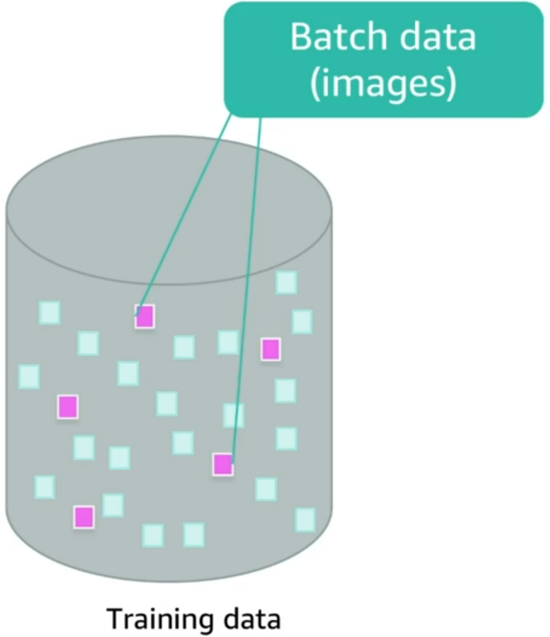
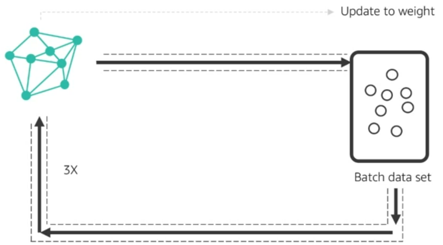
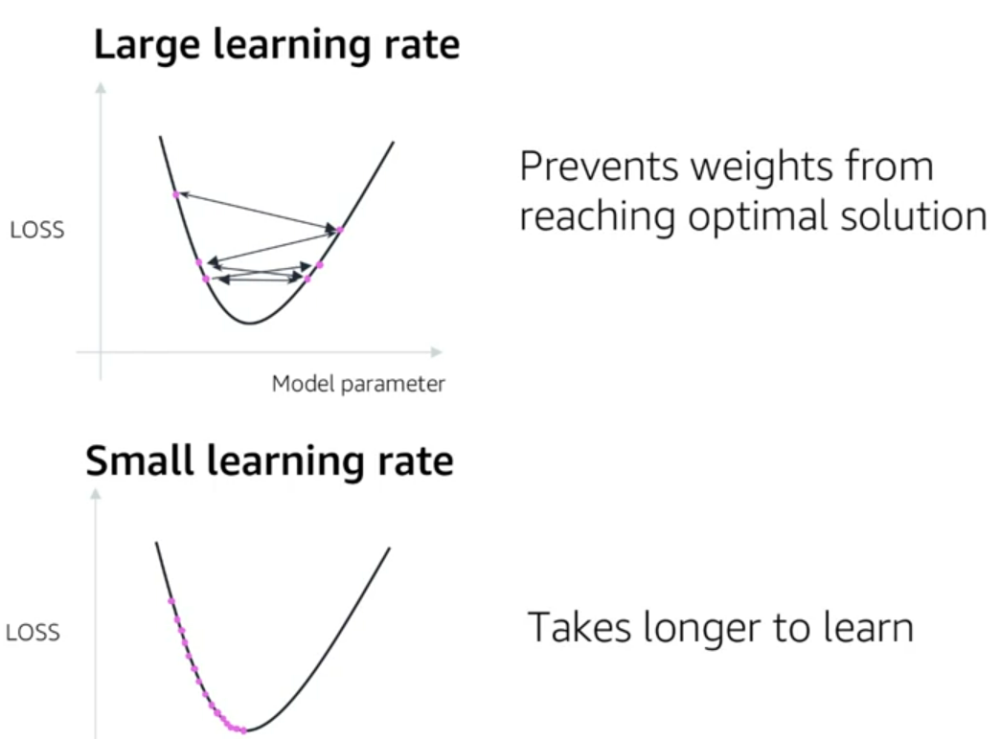
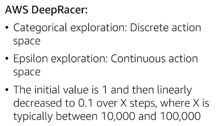
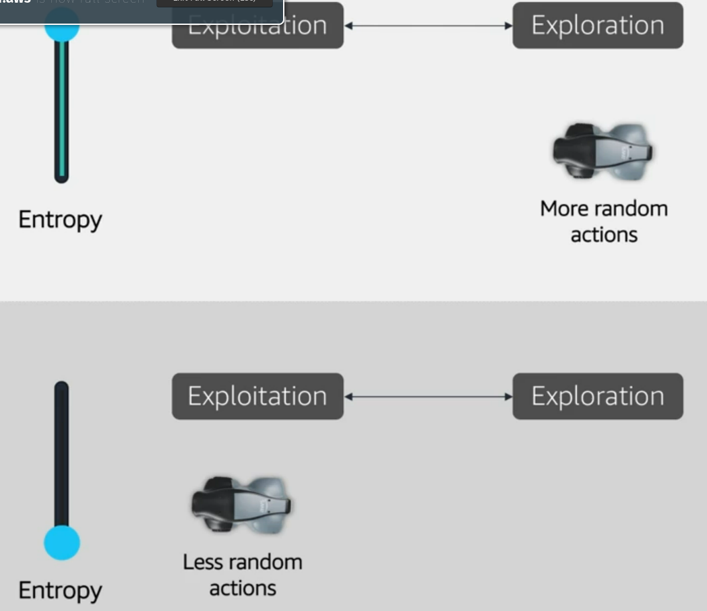
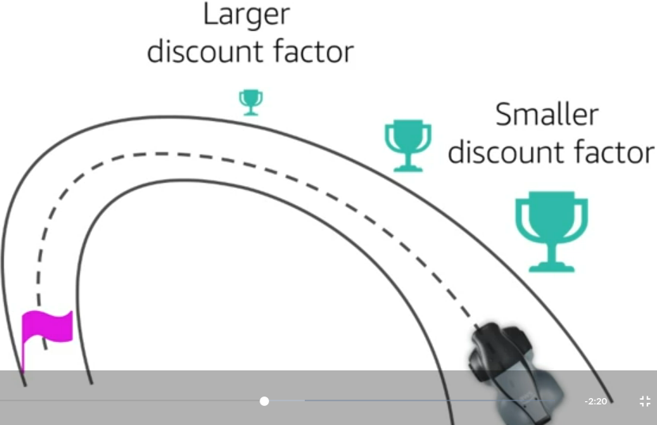
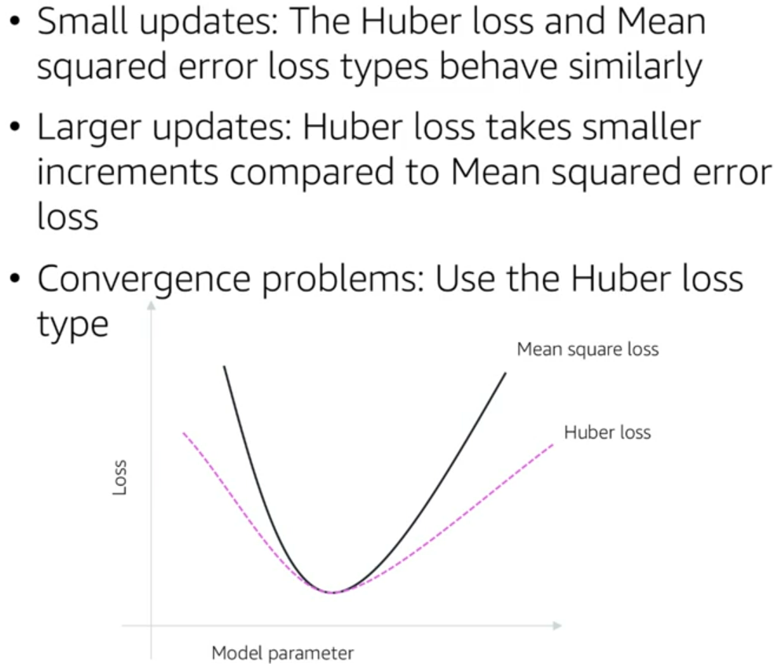

# AWS DeepRacer

Bem-vindo(a) ao repositório de estudo de Reinforcement Learning! Este repositório tem como objetivo fornecer uma coleção abrangente de recursos para aqueles que desejam aprender e aprimorar seus conhecimentos em Reinforcement Learning (Aprendizado por Reforço, em português).

Boa parte do conteúdo deste repositório tomou como referência este [curso gratuito de Reinforcement Learning da AWS DeepRacer](https://explore.skillbuilder.aws/learn/course/external/view/elearning/87/aws-deepracer-driven-by-reinforcement-learning).

Reinforcement Learning é uma subárea da inteligência artificial que permite que um agente aprenda a tomar decisões em um ambiente, a partir do feedback que recebe ao executar determinadas ações. É uma técnica poderosa que tem sido aplicada em diversas áreas, incluindo robótica, jogos, finanças, controle de processos e muitas outras.

## Índice
- O que é o AWS DeepRacer
- Reinforcement Learning
- Tipos de algorítmos de Machine Learning

## O que é o AWS DeepRacer
O [AWS DeepRacer](https://aws.amazon.com/pt/deepracer/?nc1=h_ls) é um serviço de aprendizado de máquina (ML) da Amazon Web Services (AWS) que permite que desenvolvedores e entusiastas de robótica construam, treinem e testem seus próprios modelos de aprendizado por reforço para corridas de carros autônomos! Ele fornece um ambiente simulado para o treinamento de modelos de aprendizado de máquina em corridas de carros autônomos, permitindo que os desenvolvedores experimentem e aprimorem seus modelos em um ambiente seguro e virtual antes de implementá-los em carros reais.

O AWS DeepRacer é projetado para ajudar a democratizar o aprendizado de máquina, tornando-o acessível a uma ampla gama de usuários, independentemente de suas habilidades técnicas e conhecimentos prévios em robótica ou aprendizado de máquina. O serviço também possui uma comunidade ativa de usuários que compartilham seus modelos, dicas e truques, tornando-o um ambiente colaborativo para aprimoramento do aprendizado de máquina e da robótica.

## Reinforcement Learning

Existem três tipos principais de algoritmos de machine learning: supervisionado, não supervisionado e por reforço.

    Aprendizado supervisionado: é quando um modelo é treinado em um conjunto de dados rotulados, onde cada exemplo é fornecido com uma resposta correta. O objetivo é que o modelo possa aprender a generalizar as relações entre os recursos e as respostas para fazer previsões precisas em novos dados. Exemplos de algoritmos de aprendizado supervisionado incluem regressão linear, regressão logística e árvores de decisão.

    Aprendizado não supervisionado: é quando um modelo é treinado em um conjunto de dados não rotulados, onde não há respostas corretas fornecidas. O objetivo é que o modelo possa descobrir padrões ou estruturas ocultas no conjunto de dados. Exemplos de algoritmos de aprendizado não supervisionado incluem clusterização e redução de dimensionalidade.

    Aprendizado por reforço: é quando um modelo é treinado para tomar decisões em um ambiente dinâmico, recebendo feedback em forma de recompensas ou penalidades pelo seu comportamento. O objetivo é que o modelo possa aprender a tomar ações que maximizem a recompensa ao longo do tempo. Exemplos de algoritmos de aprendizado por reforço incluem Q-Learning e Deep Q-Networks.

## Hyperparameter Tuning

Este capítulo descreve cada um dos hiperparâmetros disponíveis no AWS DeepRacer e as implicações que eles têm para o desempenho da pista.

Hiperparâmetros em machine learning são parâmetros que não são aprendidos diretamente durante o treinamento de um modelo, mas que afetam o processo de treinamento e o desempenho do modelo. Eles são definidos antes do treinamento do modelo e controlam a forma como o modelo é treinado, como a taxa de aprendizado e o número de iterações.

Os hiperparâmetros são usados para ajustar a complexidade do modelo e evitar overfitting ou underfitting. Overfitting ocorre quando o modelo é ajustado demais aos dados de treinamento e não consegue generalizar para novos dados, enquanto o underfitting ocorre quando o modelo é muito simples e não consegue capturar a complexidade dos dados de treinamento.

Exemplos comuns de hiperparâmetros incluem a taxa de aprendizado, número de camadas ocultas em redes neurais, número de árvores em um modelo de floresta aleatória, tamanho do lote e número de épocas em algoritmos de otimização de gradiente estocástico.

A seleção adequada dos hiperparâmetros pode ser crucial para o desempenho do modelo e é uma tarefa importante no processo de desenvolvimento de um modelo de machine learning. É comum utilizar técnicas de validação cruzada para avaliar o desempenho do modelo em diferentes conjuntos de hiperparâmetros e escolher os melhores hiperparâmetros para o modelo.

* **Batch size**: Defines how much of your training data your model should work through before each new update. In the case of AWS DeepRacer, it will basically determines how many images the model will use for training where the images are randomly sampled from the most recent experience.

* **Epoch**: This hyperparameter can sometimes be confused as batch size. While the batch size determines how much of the training to loop through before updating the model, the **epoch** determines how many times the algorithm will pass through the dataset before updating the training weights.

* **Learning Rate**: Controls the speed that the algorithm learns. 

* **Exploration**: This hyperparameter gives the option to find a balance between *exploitation* (when the algorithm makes decisions given the information it already has) and *exploration* (gathers additional information beyond whats already been collected). <mark>In Reinforcement Learning, this is a particularly important parameter since data is constantly beeing collected and sent back to your model. So the exploration can help preventing the model's neural network from beeing trapped in parts of the action space / local maximum. </mark>

* **Entropy**: It controls the degree of randomness of an action that your vehicle might take in a given situation. The larger the entropy, the more random actions the car will take for exploration, and vice versa.

* **Discount Factor**: <mark>The goal of the Reinforcement Learning algorithm is to maximize the sum of the rewards of the course of time.</mark> The discount factor specifies how much of the future reward contributes to the expected reward. With a small discount factor, the agent (your vehicle) will only consider immediate rewards while a large discount factor will make the agent consider long-term rewards.  

* **Loss Type**: Its a function used to update the network's weights. For AWS DeepRacer, we can choose between two loss types: Huber Loss and Mean Squared Error Loss. When you have convergence problems, it is recommended to use **Huber Loss**, and when convergence is not a problem and you just want to train faster, it is recommended to use **Mean Squared Error** loss.

* **Number of episodes**: Defines the number of tasks your algorithm will go through during training (and tasks are the loops your model runs through when the agent takes an action in the environment, changing the state and ultimately receiving a reward). <mark>In short, it defines how many times you'll go through this loop during training</mark>.
 